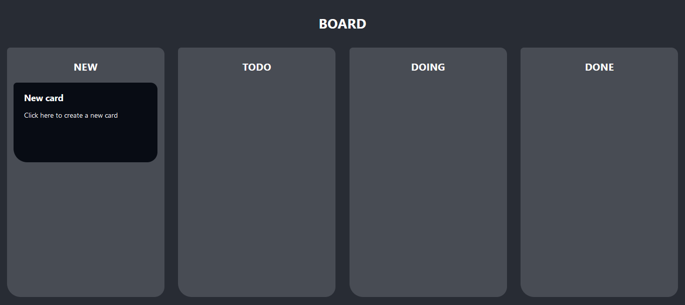
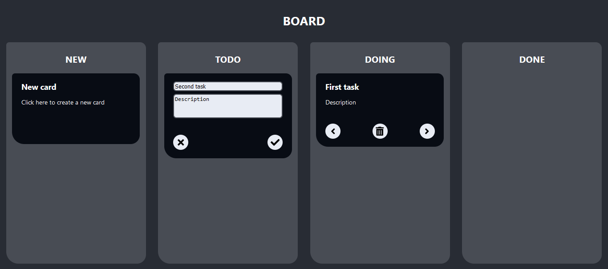

# Ada Kanban

<!-- coloque aqui um logo grande do projeto -->

The Ada Kanban project goal is to manage tasks through a board with four columns. The first column is only for creating cards for new tasks. The other three columns are: TODO, DOING and DONE. These three are columns representing the status of the tasks inside the columns.

## Technologies

<!-- 
Para badges novos:
https://shields.io

Para ícones dos badges:
https://simpleicons.org/
-->

[](https://nodejs.org/en)
[](https://reactjs.org/)
[](https://www.docker.com/)
[](https://www.docker.com/)
[](https://www.gnu.org/software/make/manual/make.html)


## License


## Content Table

- [About](#ada-kanban)
- [Technologies](#technologies)
- [Content Table](#content-table)
- [Requirements](#requirements)
- [How to run](#how-to-run)
- [Features](#features)


[Back to top](#ada-kanban)


## Requirements

### Docker

<!-- Add docker explanation and links to how to install -->


[Back to top](#ada-kanban)


### Makefile

<!-- Add makefile explanations and links to how to install -->


[Back to top](#ada-kanban)


## How to run

First, you need to set the environment variable files. Then you will be able to run the project using Make commands.

### Backend

[](https://nodejs.org/en)
[](https://www.docker.com/)
[](https://www.docker.com/)
[](https://www.gnu.org/software/make/manual/make.html)

There is a folder at the root of the project called `env`, with another folder inside called `back`. Inside `back` folder there is a file called `example.env`. Make a copy of it, calling the copy `dev.env`.

Open `dev.env` file. There are some environment variables without value in the file. Each one of them must have a value:

- `JWT_SECRET`: create a random string, any sequence of characters between letters and numbers is enough;
- `API_USERNAME`: username to allow people and services to access the API;
- `API_PASSWORD`: password to allow people and services to access the API;
- `MYSQL_ROOT_PASSWORD`: a password to access the MySQL database as root;
- `MYSQL_DATABASE`: name of the database inside MySQL;
- `MYSQL_USER`: username for the API to access MySQL database;
- `MYSQL_PASSWORD`: password for the API to access MySQL database;


[Back to top](#ada-kanban)


### Frontend

[](https://nodejs.org/en)
[](https://reactjs.org/)
[](https://www.docker.com/)
[](https://www.gnu.org/software/make/manual/make.html)

There is a folder at the root of the project called `FRONT`. Inside `FRONT` folder there is a file called `example.env`. Make a copy of it, calling the copy `.env`.

Open `.env` file. There are two environment variables without value in the file. They should have same value that was already set in the `env/back/dev.env` file:

- `REACT_APP_API_USERNAME`: username to people and services to access the API;
- `REACT_APP_API_PASSWORD`: password to people and services to access the API;


[Back to top](#ada-kanban)


### Running the machines

[](https://www.docker.com/)
[](https://www.gnu.org/software/make/manual/make.html)

#### `make start`

<!-- Explicar que faz o build das imagens e roda as três máquinas - mysql, back e front -->


[Back to top](#ada-kanban)


#### `make finish`

<!-- Explicar que faz pára as três máquinas - mysql, back e front -, remove os containers e remove as imagens -->


[Back to top](#ada-kanban)


#### `make api-print-logs`

<!-- Explicar que mostra os logs da máquina de api -->


[Back to top](#ada-kanban)


#### `make front-print-logs`

<!-- Explicar que mostra os logs da máquina do front -->


[Back to top](#ada-kanban)


## Features

### API

[](https://nodejs.org/en)
[](https://www.docker.com/)
[](https://www.docker.com/)
[](https://www.gnu.org/software/make/manual/make.html)

There is a backend API built using Node that communicates to a database in MySQL. The requests should be made using `json`, and the responses will be giving in `json` too.

There are five endpoints at the API. In the Requests, the content between `<<` and `>>` marks should be replaced by real content and the `<<` and `>>` marks should be removed. In the Responses, the content between `<<` and `>>` marks is a example and the `<<` and `>>` marks will not be there when you really execute the Requests and receive real Responses.


#### POST `/login`

This Request is necessary in order to make the other Requests. It will have a token in its Response and this token must be used in the Header of the other Requests.

Request Body example:

```json
{
    "username": "<<username to api>>",
    "password": "<<password to api>>"
}
```

Response example:

```json
{
    "token": "<<the token you will use in the other requests>>"
}
```


[Back to top](#ada-kanban)


#### GET `/cards`

List all the cards in the board.

Request Header example:

```json
{
	"Content-Type": "application/json",
	"Authorization": "Bearer <<the token>>"
}
```

Request Body example:

```json
// empty
```

Response example:

```json
[
    {
        "id": "<<card id>>",
        "title": "<<card title>>",
        "content": "<<card content>>",
        "column": "<<TODO, DOING or DONE>>",
        "createdAt": "<<date and time>>",
        "updatedAt": "<<date and time>>"
    },
    {
        "id": "<<card id>>",
        "title": "<<card title>>",
        "content": "<<card content>>",
        "column": "<<TODO, DOING or DONE>>",
        "createdAt": "<<date and time>>",
        "updatedAt": "<<date and time>>"
    },
	//other cards, same format as above ones...
]
```


[Back to top](#ada-kanban)


#### POST `/cards`

Create a card with the title, content and column sent.

Request Header example:

```json
{
	"Content-Type": "application/json",
	"Authorization": "Bearer <<the token>>"
}
```

Request Body example:

```json
{
	"title": "<<card title>>",
	"content": "<<card content>>",
	"column": "<<TODO, DOING or DONE>>",
}
```

Response example:

```json
{
	"id": "<<card id>>",
	"title": "<<card title>>",
	"content": "<<card content>>",
	"column": "<<TODO, DOING or DONE>>",
	"createdAt": "<<date and time>>",
	"updatedAt": "<<date and time>>"
}
```


[Back to top](#ada-kanban)


#### PUT `/cards/<<card id>>`

Update title, content and column of the card identifying it by its ID. The ID in the url must be the same as the ID in the Body.

Request Header example:

```json
{
	"Content-Type": "application/json",
	"Authorization": "Bearer <<the token>>"
}
```

Request Body example:

```json
{
    "id": "<<card id>>",
	"title": "<<card title>>",
	"content": "<<card content>>",
	"column": "<<TODO, DOING or DONE>>",
}
```

Response example:

```json
{
	"id": "<<card id>>",
	"title": "<<card title>>",
	"content": "<<card content>>",
	"column": "<<TODO, DOING or DONE>>",
	"createdAt": "<<date and time>>",
	"updatedAt": "<<date and time>>"
}
```


[Back to top](#ada-kanban)


#### DELETE `/cards/<<id>>`

Delete the card by its ID and returns the list of rest of the cards.

Request Header example:

```json
{
	"Content-Type": "application/json",
	"Authorization": "Bearer <<the token>>"
}
```

Request Body example:

```json
// empty
```

Response example:

```json
[
    {
        "id": "<<card id>>",
        "title": "<<card title>>",
        "content": "<<card content>>",
        "column": "<<TODO, DOING or DONE>>",
        "createdAt": "<<date and time>>",
        "updatedAt": "<<date and time>>"
    },
    {
        "id": "<<card id>>",
        "title": "<<card title>>",
        "content": "<<card content>>",
        "column": "<<TODO, DOING or DONE>>",
        "createdAt": "<<date and time>>",
        "updatedAt": "<<date and time>>"
    },
	//other cards, same format as above ones...
]
```


[Back to top](#ada-kanban)


### Graphical Interface

[](https://nodejs.org/en)
[](https://reactjs.org/)
[](https://www.docker.com/)
[](https://www.gnu.org/software/make/manual/make.html)

A frontend using React was developed.



The frontend shows all the existent cards and allows you to create new cards, edit them by clicking on the title or text, move the cards between columns and delete the cards.




[Back to top](#ada-kanban)


## Acknowledgment

<!-- Session to thank people, Acknowledgment = Reconhecimento -->


[Back to top](#ada-kanban)
