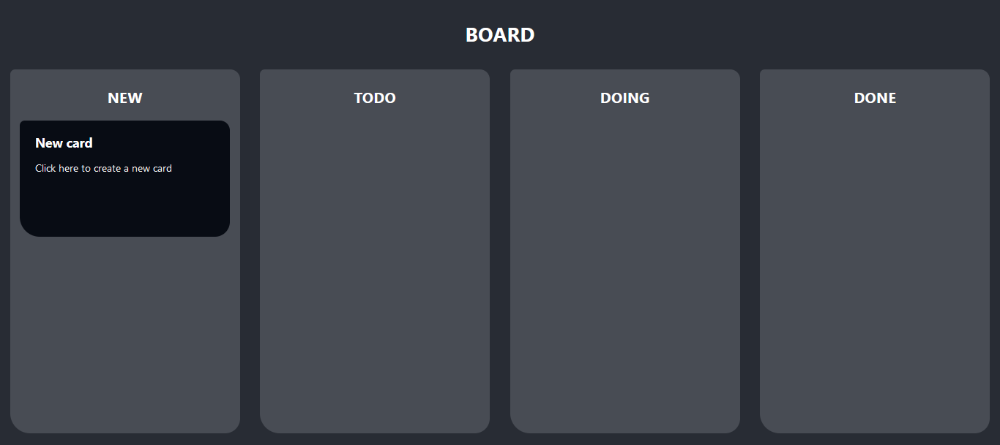
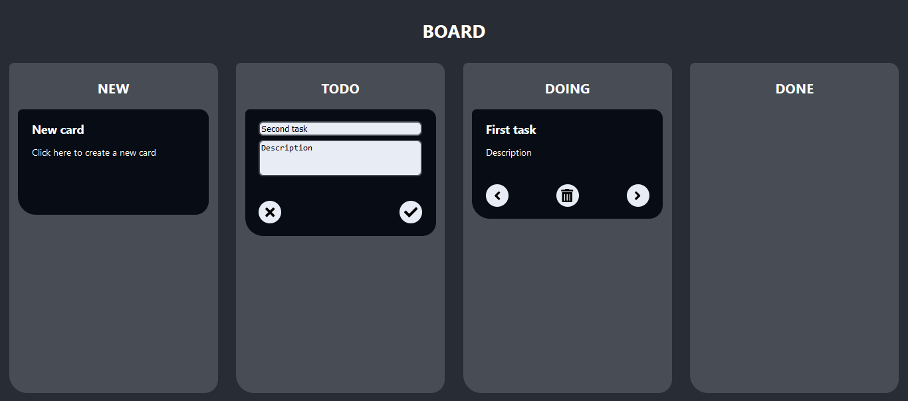

---

<a name="menu"></a>
<p align="center">
<a href="README.md">Home</a>
&nbsp;&bull;&nbsp;
<a href="installation.md">Installation</a>
&nbsp;&bull;&nbsp;
<a href="how-to-run.md">How to run</a>
&nbsp;&bull;&nbsp;
<a href="features.md">Features</a>
</p>

---

# Features

## API

[](https://nodejs.org/en)
[](https://www.docker.com/)
[](https://www.docker.com/)
[](https://www.gnu.org/software/make/manual/make.html)

There is a backend API built using Node that communicates to a database in MySQL. The requests should be made using `json`, and the responses will be giving in `json` too.

There are five endpoints at the API. In the Requests, the content between `<<` and `>>` marks should be replaced by real content and the `<<` and `>>` marks should be removed. In the Responses, the content between `<<` and `>>` marks is a example and the `<<` and `>>` marks will not be there when you really execute the Requests and receive real Responses.


### POST `/login`

This Request is necessary in order to make the other Requests. It will have a token in its Response and this token must be used in the Header of the other Requests.

Request Body example:

```json
{
    "username": "<<username to api>>",
    "password": "<<password to api>>"
}
```

Response example:

```json
{
    "token": "<<the token you will use in the other requests>>"
}
```


<a href="#menu">Back to top</a>


### GET `/cards`

List all the cards in the board.

Request Header example:

```json
{
	"Content-Type": "application/json",
	"Authorization": "Bearer <<the token>>"
}
```

Request Body example:

```json
// empty
```

Response example:

```json
[
    {
        "id": "<<card id>>",
        "title": "<<card title>>",
        "content": "<<card content>>",
        "column": "<<TODO, DOING or DONE>>",
        "createdAt": "<<date and time>>",
        "updatedAt": "<<date and time>>"
    },
    {
        "id": "<<card id>>",
        "title": "<<card title>>",
        "content": "<<card content>>",
        "column": "<<TODO, DOING or DONE>>",
        "createdAt": "<<date and time>>",
        "updatedAt": "<<date and time>>"
    },
	//other cards, same format as above ones...
]
```


<a href="#menu">Back to top</a>


### POST `/cards`

Create a card with the title, content and column sent.

Request Header example:

```json
{
	"Content-Type": "application/json",
	"Authorization": "Bearer <<the token>>"
}
```

Request Body example:

```json
{
	"title": "<<card title>>",
	"content": "<<card content>>",
	"column": "<<TODO, DOING or DONE>>",
}
```

Response example:

```json
{
	"id": "<<card id>>",
	"title": "<<card title>>",
	"content": "<<card content>>",
	"column": "<<TODO, DOING or DONE>>",
	"createdAt": "<<date and time>>",
	"updatedAt": "<<date and time>>"
}
```


<a href="#menu">Back to top</a>


### PUT `/cards/<<card id>>`

Update title, content and column of the card identifying it by its ID. The ID in the url must be the same as the ID in the Body.

Request Header example:

```json
{
	"Content-Type": "application/json",
	"Authorization": "Bearer <<the token>>"
}
```

Request Body example:

```json
{
    "id": "<<card id>>",
	"title": "<<card title>>",
	"content": "<<card content>>",
	"column": "<<TODO, DOING or DONE>>",
}
```

Response example:

```json
{
	"id": "<<card id>>",
	"title": "<<card title>>",
	"content": "<<card content>>",
	"column": "<<TODO, DOING or DONE>>",
	"createdAt": "<<date and time>>",
	"updatedAt": "<<date and time>>"
}
```


<a href="#menu">Back to top</a>


### DELETE `/cards/<<id>>`

Delete the card by its ID and returns the list of rest of the cards.

Request Header example:

```json
{
	"Content-Type": "application/json",
	"Authorization": "Bearer <<the token>>"
}
```

Request Body example:

```json
// empty
```

Response example:

```json
[
    {
        "id": "<<card id>>",
        "title": "<<card title>>",
        "content": "<<card content>>",
        "column": "<<TODO, DOING or DONE>>",
        "createdAt": "<<date and time>>",
        "updatedAt": "<<date and time>>"
    },
    {
        "id": "<<card id>>",
        "title": "<<card title>>",
        "content": "<<card content>>",
        "column": "<<TODO, DOING or DONE>>",
        "createdAt": "<<date and time>>",
        "updatedAt": "<<date and time>>"
    },
	//other cards, same format as above ones...
]
```


<a href="#menu">Back to top</a>


## Graphical Interface

[](https://nodejs.org/en)
[](https://reactjs.org/)
[](https://www.docker.com/)
[](https://www.gnu.org/software/make/manual/make.html)

A frontend using React was developed.



The frontend shows all the existent cards and allows you to create new cards, edit them by clicking on the title or text, move the cards between columns and delete the cards.




<a href="#menu">Back to top</a>
